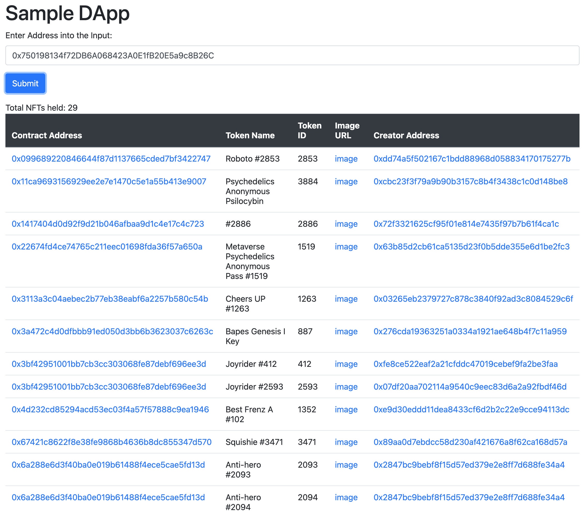

## NFTPort: Retrieve NFTs owned by an account.

The [endpoint](https://docs.nftport.xyz/docs/nftport/b3A6MjE0MDYzNzM-retrieve-nf-ts-owned-by-an-account) Returns NFTs owned by a given account (i.e. wallet) address. Can also return each NFT metadata with include parameter.

It is useful for:

- For checking if a user owns a specific NFT and then unlocking specific activity.
- Adding NFT portfolio section to your apps.

Follow the guide [here]() to build yours.

To run this sample app on your local machine:

- git clone https://github.com/emmaodia/tutorials-code/nftport-rnoba.git
- open `index.html` in a browser

Send me a message on [LinkedIn](https://linkedin.com/in/emmaodia)
